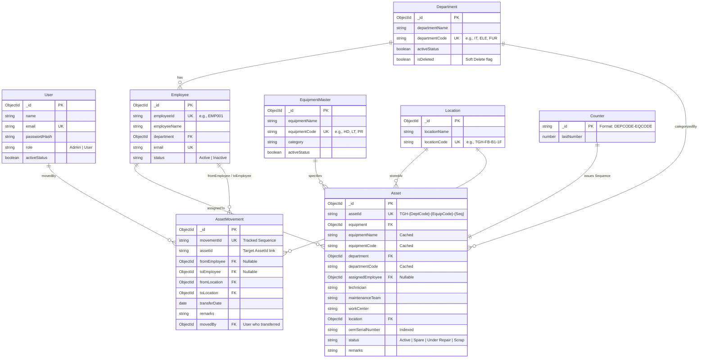

# TGH Asset Management System — Database Architecture & ER Diagram

This document contains the complete database architectural specification, Entity-Relationship (ER) diagram, and validation workflows for the **TGH Asset Management System**. All Mongoose models have been fully modeled, typed, and integrated into `/server/models/`.

---

## 1. Entity-Relationship (ER) Diagram

Below is the database relationship mapping depicted in Mermaid notation and ASCII structure, showing reference relations (`ref`), composite indexes, and data-flow integrity.

### Mermaid Diagram


---

## 2. Mongo Collection Index & Optimization Strategy

To support high performance across 1,000+ assets with lightning-fast query filters and global text searches, the database incorporates targeted indices:

| Collection | Focus Indexes | Index Type | Purpose |
| :--- | :--- | :--- | :--- |
| **users** | `email: 1` | Unique Single-Field | Fast auth lookups |
| **departments** | `departmentCode: 1`, `isDeleted: 1` | Unique / Filter Index | Prevents duplicates & optimizes soft deleted filters |
| **equipmentMasters** | `equipmentCode: 1` | Unique Single-Field | Standardizes master codes |
| **employees** | `employeeId: 1`, `email: 1` | Unique Compound/Single | Distinct identification & email searches |
| **locations** | `locationCode: 1` | Unique Single-Field | Guarantees room representation uniqueness |
| **assets** | `assetId: 1`<br>`equipmentCode: 1`<br>`departmentCode: 1`<br>`oemSerialNumber: 1`<br>`status: 1`<br>`(assetId, equipmentName, oemSerialNumber, ...)` | Unique Single-Field<br>Filtered Index<br>Filtered Index<br>Standard Search Index<br>Standard Filter Index<br>**Text Index (Compound)** | Ensures atomic integrity<br>Speeds up group reports<br>Speeds up group reports<br>Find assets by hardware Serial<br>Dashboard filter aggregations<br>**Drives Global Smart Search** |
| **assetMovements** | `movementId: 1`, `assetId: 1` | Unique Single-Field | Uniquely tracks event ledgers & historical assets |

---

## 3. Atomic Sequence & ID Generation Workflow

A central requirement is generating sequential, non-duplicable custom Asset IDs using the format `TGH-{DepartmentCode}-{EquipmentCode}-{Sequence}` (e.g., `TGH-IT-LT-0001`).

### Double-Lock Verification Protocol:
1. **Dynamic ID Splicing**: The backend extract department and equipment codes during validation.
2. **MongoDB Atomic Counter**:
   ```javascript
   const key = `${departmentCode}-${equipmentCode}`; // e.g. "IT-LT"
   const counter = await Counter.findByIdAndUpdate(
     key,
     { $inc: { lastNumber: 1 } },
     { new: true, upsert: true }
   );
   const sequenceStr = String(counter.lastNumber).padStart(4, "0");
   const assetId = `TGH-${departmentCode}-${equipmentCode}-${sequenceStr}`;
   ```
3. **Isolation and Consistency**: Because `findOneAndUpdate` with `$inc` is atomic, parallel asset registrations will never produce overlapping sequences.

---

## 4. Movement Accountability Ledger

The `assetMovements` collection acts as an immutable physical history log. It is **forbidden** to modify or delete historical rows:
- Every asset department or location/employee reassignment triggers an `AssetMovement` event.
- It records the full transition history: `fromEmployee` to `toEmployee`, and `fromLocation` to `toLocation`.
- The system automatically stamps the transaction with `transferDate` and the logged-in operator's user reference `movedBy`.
